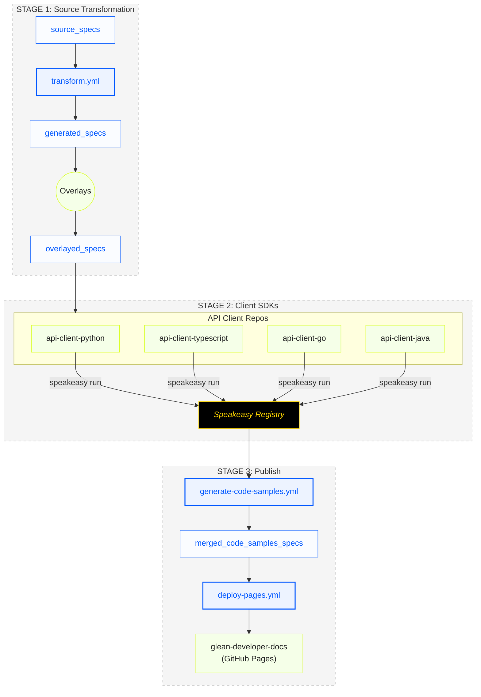

# OpenAPI Preprocessor

Preprocesses our OpenAPI specs to prepare them for generation via Speakeasy (our API client library generator).

## Spec Directories

This repository manages several types of OpenAPI specifications in different directories:

| Directory | Purpose |
|-----------|---------|
| `source_specs/` | Original OpenAPI specification files provided as input to the transformation process. These are the source of truth for our API definitions. |
| `generated_specs/` | Transformed OpenAPI specs with server URL subpaths moved to individual API paths. These files are consumed by Speakeasy to generate client libraries. |
| `overlayed_specs/` | Specs with various overlays applied (see Overlays section below). The overlays add additional metadata or modifications needed for specific purposes. |
| `merged_code_samples_specs/` | Specs with code samples merged from multiple sources. These enhanced specs provide examples for documentation and developer usage. |

## Overlays

The `overlays` directory contains OpenAPI Specification overlay files used to modify the base specs:

| File | Description |
|------|-------------|
| `info-name-overlay.yaml` | Modifies the API title and adds Speakeasy naming metadata to improve SDK generation. |
| `strip-headers-overlay.yaml` | Removes specific authentication headers from the API specification that shouldn't be exposed in the generated SDKs. |
| `speakeasy-modifications-overlay.yaml` | Contains extensive Speakeasy-specific modifications to improve SDK generation, including method name overrides and grouping information. |

These overlay files use the OpenAPI Specification Overlay format (RFC9535) to apply targeted modifications to the base specs without changing the original files. Speakeasy uses these overlays during the SDK generation process.

## Merged Code Samples Specs

The `merged_code_samples_specs` directory contains OpenAPI specifications with embedded code samples:

| File | Description |
|------|-------------|
| `glean-client-merged-code-samples-spec.yaml` | Client API specification enhanced with code samples in multiple programming languages. Used for documentation and SDK generation. |
| `glean-index-merged-code-samples-spec.yaml` | Indexing API specification enhanced with code samples in multiple programming languages. Used for documentation and SDK generation. |

These files are generated by Speakeasy after external repositories have run their workflows and uploaded code samples to the Speakeasy registry. They provide developers with working code examples for each API endpoint.

## Overlayed Specs

The `overlayed_specs` directory contains merged OpenAPI specifications that combine multiple API definitions:

| File | Description |
|------|-------------|
| `glean-merged-spec.yaml` | A comprehensive merged spec containing both the Client and Indexing APIs in a single document. This provides a unified view of all Glean APIs and includes Speakeasy-specific extensions (x-speakeasy-*) for code generation. |

These merged specs are used for generating consistent client libraries across multiple APIs and provide a single source of documentation.

## Overview Diagram



## Workflows

This repository uses several GitHub Actions workflows to process the OpenAPI specifications:

| Workflow | Purpose | Trigger |
|----------|---------|---------|
| `transform.yml` | Transforms source specs and runs the `glean-api-specs` Speakeasy source to generate API specs. | Push to main (source_specs changes), schedule, manual |
| `generate-code-samples.yml` | Runs Speakeasy to generate merged code samples specs. | Manual only |
| `deploy-pages.yml` | Deploys specs to GitHub Pages. | After generate-code-samples completes, manual |

The processing follows this sequence:

1. Transform specs from source files
2. External repositories consume these specs and generate their code samples
3. We manually trigger code sample generation which pulls from Speakeasy registry
4. GitHub Pages deployment publishes all specs for browsing

## Transformation Process

The GitHub Action that transforms OpenAPI YAML specification files by:

1. Downloading files from specified URLs
2. Moving the server URL subpath to each individual API path
3. Writing the transformed files to the `generated_specs/` directory

This action performs the following transformations:

- **Before**: `servers.url = "https://{domain}-be.glean.com/rest/api/v1"`, `path = "/activity"`
- **After**: `servers.url = "https://{domain}-be.glean.com/"`, `path = "/rest/api/v1/activity"`

## Output

Transformed files are saved to the `generated_specs/` directory:

- `generated_specs/client_rest.yaml`
- `generated_specs/indexing.yaml`

## Usage

See usage in the `./github/workflows/transform.yml` workflow.

## Development

To set up the development environment:

1. Clone the repository
2. Install dependencies:

   ```bash
   npm install
   ```

3. Run tests:

   ```bash
   npm test
   ```

4. Build the action:

   ```bash
   npm run build
   ```
